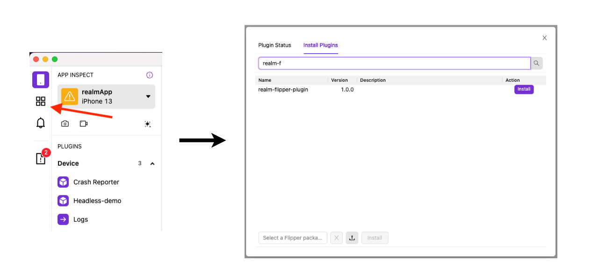

# Getting Started
The Realm Flipper Plugin allows you to debug React Native apps using Realm Databases. 

## Desktop
First, make sure you have downloaded [Flipper](https://fbflipper.com/). You can download the Realm Flipper Plugin from the Flipper plugin manager. Inside the "Install Plugin" tab, you can search for realm-flipper-plugin and install it. After reloading Flipper, the Plugin can be enabled for React Native applications using Realm. 


To facilitate communication between the desktop and the Realm Database on the device, you need the Realm Flipper Device npm package.
## Device
Install [Realm Flipper Plugin Device](https://www.npmjs.com/package/realm-flipper-plugin-device) using NPM:

`npm install realm-flipper-plugin device`

Next, import it and add it to your component tree:

```tsx
import {StyleSheet, Text, View} from 'react-native';
import Realm from 'realm';
import RealmPlugin from 'realm-flipper-plugin-device'; //import
import React from 'react';

export default function App() {
  const Cat = {
    name: 'Cat',
    properties: {
      _id: 'objectId',
      name: 'string',
      age: 'int',
      type: 'string',
    },
    primaryKey: '_id',
  };
  // open a local realm with the 'Cat' schema
  const realm = new Realm({
    schema: [Cat],
    schemaVersion: 2,
  });

  return (    
    <View style={styles.container}>
      <RealmPlugin realms={[realm]} /> {/* pass in the Realm to the plugin*/}
      <Text>Open up App.js to start working on your app!</Text>
    </View>
  );
}
```


For a more detailed example using multiple schemas, see our [testApp inside this repository](https://github.com/realm/realm-flipper-plugin/blob/main/testApp/App.tsx).
